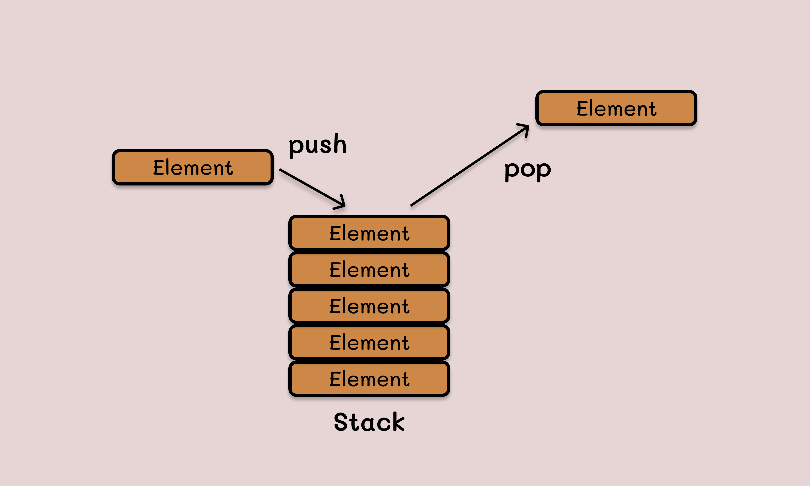

# DataStructureLearning

## Stacks

### LIFO
Last in first out

### Stack is used for
- Remembering partially completed tasks.
- Undoing or backtracking from an action.

### Cost
Stacks come with a cost of memory. For each element we place on the stack, we allocate a stack frame to it. So if we keep adding to a stack, we might run out of space.
**Stack overflow** - This might leads to crashes and stuck processes.